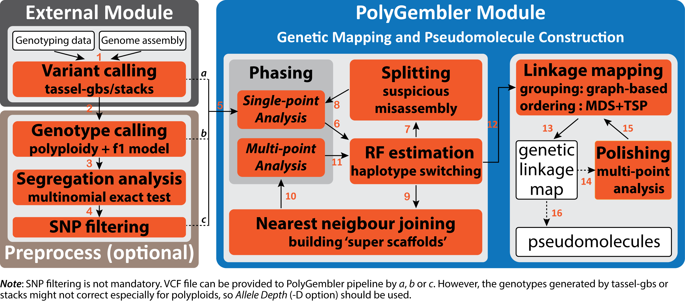

# *polyGembler*: pseudomolecule construction combining *de novo* assembly and genetic mapping

--------------------

<h2 id="overview">Overview</h2>

*polyGembler* is for construction of genetic linakge maps or chromosomal-scale pseudomolecules combining *de novo* genome assembly and genetic mapping. The method assumes availability of genome-wide genotyping data such as [GBS](https://en.wikipedia.org/wiki/Genotyping_by_sequencing), [RAD-seq](https://en.wikipedia.org/wiki/Restriction_site_associated_DNA_markers) and [SNP array](https://en.wikipedia.org/wiki/SNP_array) data, collected on a F1 outbred mapping population, as well as high coverage (i.e. greater than 30X) whole genome sequence data on a reference sample, or alternatively the availability of a set of reference contigs or scaffolds. By mapping marker set to contigs, *polyGembler* infers contig haplotypes for each sample. Contig haplotypes are then used to infer linkage groups corresponding to chromosomes as well as the optimal ordering of contigs within these chromosomes.

*polyGembler* provides a standalone haplotype phasing tool for outbred mapping populations (*haplotyper*, see [quick-start](#cmd_haplotyper)). It accepts either genotype data or allele depth data and support polyploids. It is very robust to the presence of substantial amounts of missing genotype data and genotyping errors and therefore can handle low-coverage, error-prone genotyping data generated with the NGS-based high-throughput genetic marker discovery methods such as [GBS](https://en.wikipedia.org/wiki/Genotyping_by_sequencing), [RAD-seq](https://en.wikipedia.org/wiki/Restriction_site_associated_DNA_markers) and [RRL](https://en.wikipedia.org/wiki/Reduced_representation_bisulfite_sequencing).

*polyGembler* also provides a tool for simulating outbred F1 mapping population GBS data. It uses the software [PedigreeSim V2.0](https://www.wur.nl/en/show/Software-PedigreeSim.htm) to simulate the full-sib family genomes and imitates the [GBS protocol](http://journals.plos.org/plosone/article?id=10.1371/journal.pone.0019379) to generate GBS reads.

*polyGembler* is written in Java. It has a user friendly design. All the tasks could be done with an one-liner command require no further manual intervention. It has been multithreaded where possible.

<h2 id="installation">Installation</h2>

<h4 id="download">Download from the releases</h4>

The release includes an executable jar file with all dependencies, which could be run directly.

<h4 id="compile">Compile from source code</h4>

Java build tool either [Apache Ant](http://ant.apache.org/) or [Apache Maven](https://maven.apache.org/) is required.

Quick installation guide:

    $ git clone https://github.com/c-zhou/polyGembler.git
    $ cd polyGembler
    
    $ ant
    or
    $ mvn clean package

Both of them will generate an executable jar file *polyGembler-${version}-jar-with-dependencies.jar*. For [Apache Ant](http://ant.apache.org/), the jar file is under *polyGembler/dist* directory. For [Apache Maven](https://maven.apache.org/), the jar file is under *polyGembler/target* directory.

The code has been tested with Java 7 and 8. The default version is Java 8. The [Apache Maven](https://maven.apache.org/) will fail if the system default Java version is not 8. This could be solved by either changing the system Java version or modifying the *pom.xml* file at line 22-23. You can change the Java version for [Apache Ant](http://ant.apache.org/) by modifying the *build.xml* file at line 10-11.

<h2 id="prerequisites">Prerequisites for running polyGembler</h2>

*polyGembler* is a java program. You need [JRE](https://www.oracle.com/java/technologies/javase-downloads.html) installed in your system to run *polyGembler*. The code has been tested with Java 7 and 8. It should to safe to run the program with Java 7 or a newer version.

For genetic linkage map construction (*polyGembler* program *map*), *R* need to be available in your system as well. *R* packages *argparse*, *TSP*, *MDSMap*, *igraph*, *doParallel*, and *foreach* need to be installed. 

<h2 id="pipeline">A pipeline for whole-chromosome pseudomolecule construction</h2>

A one-liner command can be used to run *polyGembler* for construction of whole-chromosome pseudomolecules.

*Input*&nbsp;&nbsp;&nbsp;&nbsp;&nbsp;&nbsp;a VCF file, a FASTA file of contigs/scaffolds

*Output*&nbsp;&nbsp;&nbsp;several files related to the pseudomolecule construction

*Command*

    $ java -jar polyGembler-${version}-jar-with-dependencies.jar gembler -i ${in_vcf_file} -a ${seq_fasta_file} -p ${ploidy} -parent ${parent_samples} -t 32
    
The program takes input a VCF file and a FASTA file containing contig/scaffold sequences and outputs several files related to the pseudomolecule construction (see [detailed outputs](#out_gembler)). Some important parameters include the ploidy (-p option) and the parent samples (-parent option) and see [detailed options](#opt_gembler) for other options. This pipeline could be time-consuming, so it is important run it with as many threads as possible (-t option).

The pipeline comprises more than ten steps calling different *polyGembler* subprograms (see [quick-start](#quick_start)). The figure above depicts the flowchart of the pipeline. *polyGembler* first converts the input VCF file to a zip file (*datapreparation*) that can be read by *polyGembler* programs. It then runs haplotype phasing for each contig/scaffold (*haplotyper*) and detects assembly errors (*asmerr*). The misaseembled contigs/scaffolds are split to generate new contigs/scaffolds which subject to another round of haplotype phasing (*haplotyper*). With the haplotype phasing results, *polyGembler* calculates recombination frequencies (RFs) for each pair of contigs/scaffolds (*twopoint*) which are used to build super scaffolds (*superscaffold*). *polyGembler* performs one more round of haplotype phasing with super scaffolds to improve the accuracy of haplotypes for contigs/scaffolds. The pairwise RFs between contigs/scaffolds are refined with the haplotypes of superscaffolds (*twopoint*). The RFs for SNP pairs within each contig/scaffold are also calculated to estimate the genetic length of the contig/scaffold (*singlepoint*). Next, with the RF estimations, *polyGembler* constructs genetic linkage maps for contigs/scaffolds (*map*). The genetic linkage maps are then subject to several rounds of polishing before finalisation. Precisely, for each linkage map, *polyGembler* run haplotype phasing for it on the whole-linkage-map scale followed by RF estimations and reordering of contigs/scaffolds. This process repeats for several rounds. Finally, pseudomolecules are constructed based on the polished genetic linkage maps (*chromosomer*). The superscaffold and polishing steps are optional for refinement and can be turned off by specific parameter settings (see [detailed options](opt_gembler)).

The pseudomolecule construction pipeline can be time-consuming and resource-intensive, which is impractical to run *gembler* for extremely large datasets. It is possible, however, to run the pipeline step by step with a high performance computing (HPC) system. In the [example](example/) folder, we provide a script ([gembler_daemon.sh](example/gembler_daemon.sh)) to run the pipeline with HPC using [Slurm Workload Manager](https://slurm.schedmd.com/documentation.html). The scripts support other workload managers such as [PBS](https://en.wikipedia.org/wiki/Portable_Batch_System) and [LSF](https://en.wikipedia.org/wiki/Platform_LSF) are yet to come.

<h2 id="quick_start">A quick start for running polyGembler programs</h2>

*polyGembler* consists of twelve programs. To get a full list of these programs, run 

	$ java -jar polyGembler-${version}-jar-with-dependencies.jar

The basic command to invoke a *polyGembler* progam is,

	$ java -jar polyGembler-${version}-jar-with-dependencies.jar ${program_name}
	
Here we give some examples for a quick start for running *polyGembler* programs.

<h4 id="cmd_simulate">1. Simulate GBS data for an outbred F1 mapping population (popsimulation & gbssimulation)</h4>

*Input*&nbsp;&nbsp;&nbsp;&nbsp;&nbsp;&nbsp;a reference FASTA file with all chromosomes

*Output*&nbsp;&nbsp;&nbsp;gzipped FASTQ files containing GBS reads for per each sample

*Command*

    $ java -jar polyGembler-${version}-jar-with-dependencies.jar popsimulation -r ${ref_fasta_file} -n 192 -p 4 -c 200 -t 32 -o ${pop_out_dir}
    $ java -jar polyGembler-${version}-jar-with-dependencies.jar gbssimulation -f ${pop_out_dir}/Sc1 -m 10 -s 5 -t 32 -o ${gbs_out_dir}

The first step simulates a tetraploid (-p option) F1 mapping population with 192 samples (-n option) from the reference genome ${ref\_fasta\_file} (-r option). The total genetic length of the chromosomes is 200cm (-c option). It uses 32 CPUs (-t option). The output sample genomes (FASTA files) will be in ${pop\_out\_dir}/Sc1 (-o option). The second step takes the simulated mapping population genomes in the first step as input (-f option). The average sequencing depth of coverage for each copy of the chromosome around the restriction enzyme is 10 (-m option) and the standard deviation is 5 (-s option). It uses 32 CPUs (-t option). The output GBS data (FASTQ file) will be in ${gbs\_out\_dir} (-o option). The program write GBS reads for each sample separately as a [gzipped](https://en.wikipedia.org/wiki/Gzip) file. If you need to put all GBS reads together, simply use the [cat](https://en.wikipedia.org/wiki/Cat_(Unix)) command.

    $ cat ${gbs_out_dir}/*.gz > ${merged_gbs_file}.gz
    
The GBS data could be used for variant calling with [TASSEL-GBS](https://bitbucket.org/tasseladmin/tassel-5-source/wiki/Tassel5GBSv2Pipeline) pipeline or [Stacks](https://catchenlab.life.illinois.edu/stacks/manual/). A example script to run [TASSEL-GBS](https://bitbucket.org/tasseladmin/tassel-5-source/wiki/Tassel5GBSv2Pipeline) is provided in [example](example/) ([runGBSv2.sh][example/runGBSv2.sh]).

<h4 id="cmd_datapreparation">2. Prepare data for running polyGembler from VCF file (datapreparation)</h4>

*Input*&nbsp;&nbsp;&nbsp;&nbsp;&nbsp;&nbsp;a VCF file

*Output*&nbsp;&nbsp;&nbsp;a zip file accept by *polyGembler* programs

*Command*

    $ java -jar polyGembler-${version}-jar-with-dependencies.jar datapreparation -i ${in_vcf_file} -s ${run_id} -u 3000 -q 30 -f 0.05 -m 0.5 -o ${out_dir}
    
The VCF file is provided with -i option. The program will filter the variants according to the parameters specified by user. Here the upper bound of total allele depth (DP field in the VCF file) for a position is set to 3000 (-u option). If the DP field exceeds 3000, the variant will be filtered out. This is used to remove ambiguous variants caused by copy number variation. The minimum quality score of a SNP is set 30 (-q option). SNPs with quality score lower than 30 will be discarded. The lower bound of minor allele frequency is set to 0.05. The rare variants called from a F1 full-sib family is very likely caused by sequencing errors. The maximum missing data rate across a locus is set to 0.5. Loci with more than 50% missing genotypes will be filtered out. It should be noted here that the program only deals with biallelic SNPs currently. The output is a zip file named ${run\_id}.zip located in directory ${out\_dir}.

<h4 id="cmd_haplotyper">3. Run haplotype phasing algorithm (haplotyper)</h4>

*Input*&nbsp;&nbsp;&nbsp;&nbsp;&nbsp;&nbsp;preprocessed zip file

*Output*&nbsp;&nbsp;&nbsp;inferred haplotypes for a contig or scaffold

*Command*

    $ java -jar polyGembler-${version}-jar-with-dependencies.jar haplotyper -i ${in_zip_file} -ex ${expriment_id} -c ${contig_str_id} -p 2 -f ${parent_sample_1}:${parent_sample_2} -D -o ${haps_out_dir}
    
The program takes the zip file generated in the data preparation step and a contig/scaffold string id as input. User need to specify the ploidy and optionally the ids of parental samples if available. -D option tells the program to use the allele depth information, which is default. Otherwise user could run it with -G option which utilises genotype information. The output file directory is specified with -o option and the output is a zip file starts with ${expriment\_id}. See [detailed outputs](#out_haplotyper) for the details about the output file.

You can run multiple contigs/scaffolds simultaneously. 

    $ java -jar polyGembler-${version}-jar-with-dependencies.jar haplotyper -i ${in_zip_file} -ex ${expriment_id} -c ${contig_str_id}:${contig_str_id2}:${contig_str_id3} -r true:false:false -s 0.05:0.1 -p 2 -f ${parent_sample_1}:${parent_sample_2} -D -o ${haps_out_dir}

This is very similar to run it with the single contig/scaffold. Multiple contigs/scaffolds are provided with string ids separated by colons. As there could be different concatenation directions, -r option specifies if each contig/scaffold is in reverse direction or not. The default is not. The distances between the adjacent contigs/scaffolds are initialised with -s option, otherwise the program will generate them randomly. The distances could either be RFs or physical distances in base pair. The program will check these numbers. If all of them are smaller than 0.5, then they will be taken as RFs, otherwise physical distances.

Expectation-maximisation (EM) algorithm is used for optimisation in construction of haplotypes, which could be trapped in local optima. Therefore, multiple independent runs should be performed to improve the accuracy. 

<h4 id="cmd_asmerr">4. Detect assembly errors (asmerr)</h4>

*Input*&nbsp;&nbsp;&nbsp;&nbsp;&nbsp;&nbsp;output files for haplotype phasing, VCF file

*Output*&nbsp;&nbsp;&nbsp;misassembled contigs/scaffolds, a new VCF 

*Command*

    $ java -jar polyGembler-${version}-jar-with-dependencies.jar asmerr -i ${haps_out_dir} -vi ${vcf_in} -r 0.1 -ex ${experiment_id} -t 8 -o ${out_prefix}

The program takes input the phased haplotypes (-i option) and the VCF file (-vi option) and outputs a list of potentially misassembled contigs/scaffolds (including the misassembly position) in ${out\_prefix}.err file as well as a new VCF file file for new contigs/scaffolds after splitting old ones in ${out\_prefix}.vcf file. The program supports multithreading (-t option). 

<h4 id="cmd_singlepoint">5. Estimate RFs for SNP pairs within contig/scaffold (singlepoint)</h4>

*Input*&nbsp;&nbsp;&nbsp;&nbsp;&nbsp;&nbsp;output files for haplotype phasing

*Output*&nbsp;&nbsp;&nbsp;a file contains the recombination information for each contig/scaffold

*Command*

    $ java -jar polyGembler-${version}-jar-with-dependencies.jar singlepoint -i ${haps_out_dir} -t 8 -ex ${experiment_id} -o ${out_prefix}

The program takes input the phased haplotypes (-i option) and outputs the recombination information for each contig/scaffold in the ${out\_prefix}.map file. There could be multiple runs of haplotype phasing for each contig/scaffold in the input directory. The RFs are then averaged on multiple runs. If the -ex option is provided, only haplotype files match the experiment id are included, otherwise the program will detect experiment id automatically.

<h4 id="cmd_twopoint">6. Estimate RFs for contig/scaffold pairs (twopoint)</h4>

*Input*&nbsp;&nbsp;&nbsp;&nbsp;&nbsp;&nbsp;output files for haplotype phasing

*Output*&nbsp;&nbsp;&nbsp;a file containing the RFs between each pair of contigs/scaffolds

*Command*

    $ java -jar polyGembler-${version}-jar-with-dependencies.jar twopoint -i ${haps_out_dir} -t 8 -ex ${experiment_id} -o ${out_prefix}

The program takes input the phased haplotypes (-i option) and outputs pairwise RFs for contigs/scaffolds in the ${out\_prefix}.txt file. There could be multiple runs of haplotype phasing for each contig/scaffold in the input directory. The minimum RF is recorded as the final estimation. If the -ex option is provided, only haplotype files match the experiment id are included, otherwise the program will detect experiment id automatically.

<h4 id="cmd_map">7. Construct genetic linkage maps (map)</h4>

*Input*&nbsp;&nbsp;&nbsp;&nbsp;&nbsp;&nbsp;singlepoint RF estimation file, twopoint RF estimation file

*Output*&nbsp;&nbsp;&nbsp;a genetic linkage map file

*Command*

    $ java -jar polyGembler-${version}-jar-with-dependencies.jar map -i ${twopoint_rf}.txt -m ${singlepoint_rf}.map -rlib ${rlib_external_dir} -t 8 -o ${out_prefix}

The program consists of two steps: grouping and ordering. To run this program, *Rscript* need to be in the environment. The *R* packages *argparse*, *TSP*, *MDSMap*, *igraph*, *doParallel*, and *foreach* should be installed. If the *R* packages are installed in non-default library paths, the option -rlib could be used to provide the installation path to the program. The output file ${out\_prefix}.mct contains the genetic map information. This program is multithreaded (-t option).

<h4 id="cmd_superscaffold">8. Construct super scaffolds (superscaffold)</h4>

*Input*&nbsp;&nbsp;&nbsp;&nbsp;&nbsp;&nbsp;twopoint RF estimation file

*Output*&nbsp;&nbsp;&nbsp;a file describes the super scaffolds

*Command*

    $ java -jar polyGembler-${version}-jar-with-dependencies.jar map -i ${twopoint_rf}.txt -r 0.1 -o ${out_prefix}

The program constructs super scaffolds with the pairwise RF estimations using a nearest-neighbour-joining method. Precisely, two contigs/scaffolds with the minimum RF are joined to generated a new scaffold if the RF is smaller than a predefined threshold (-r option). The two joined contigs/scaffolds are then deleted and the RFs between the new scaffolds and all other contigs/scaffolds are updated. The joining progress continues till the minimum RF is greater than the predefined threshold or no more contigs/scaffolds to join. The output is a file named ${out\_prefix}.par to describe the super scaffolds.

<h4 id="cmd_chromosomer">9. Construct pseudomolecules (chromosomer)</h4>

*Input*&nbsp;&nbsp;&nbsp;&nbsp;&nbsp;&nbsp;genetic linkage map file (generated by program *map*), contig/scaffold sequences in FASTA format, assembly error file (optional, generated by program *asmerr*)

*Output*&nbsp;&nbsp;&nbsp;one AGP and two FASTA files describe the pseudomolecules

*Command*

    $ java -jar polyGembler-${version}-jar-with-dependencies.jar chromosomer -i ${map_mct_file} -a ${seq_fasta_file} -e ${asm_err_file} -n 1000 -o ${out_prefix}

The program takes input the genetic linkage map file generated by program *map* (-i option), the FASTA file contains contig/scaffolds sequences (-a option) and optionally, the file contains assembly errors generated by program *asmerr* (-e option), and outputs several files to describe the pseudomolecules including two FASTA files containing sequences for raw contigs/scaffolds (after splitting for misassembly) and pseudomolecules, respectively, and an AGP file describing the architecture of pseudomolecules. To construct pseudomolecules, neighbouring raw contigs/scaffolds are joined with a poly 'n' of size defined by -n option. 

<h4 id="cmd_evaluator">10. Evaluate phasing accuracy (evaluator)</h4>

*Input*&nbsp;&nbsp;&nbsp;&nbsp;&nbsp;&nbsp;output files for haplotype phasing, reference VCF file contains true phased genotypes

*Output*&nbsp;&nbsp;&nbsp;statistics for phasing accuracy

*Command*

    $ java -jar polyGembler-${version}-jar-with-dependencies.jar evaluator -i ${haps_out_dir} -p ${true_phased_genotype_file} -ex ${experiment_id}

This is an auxiliary program independent from pseudomolecule construction. It is provided in order to evaluate the phasing accuracy of program *haplotyper*. It calculates the correct phasing rate which is defined as the proportion of the correctly phased loci with respect to the true haplotypes. The true haplotypes are provided with a VCF file (-p option) containing phased genotypes.

<h2 id="options">More parameter options for polyGembler programs</h2>

<h4 id="opt_polygembler">Twelve programs included in polyGembler</h4>
<pre>
 popsimulation                   Simulate a full-sib mapping population.
 gbssimulation                   Simulate GBS data.
 datapreparation                 Prepare data for haplotype phasing.
 haplotyper                      Haplotype phasing from a mapping population.
 asmerr                          Correct assembly errors.
 singlepoint                     Signle-point analysis: estimate recombination fraction between markers within contigs/scaffolds.
 twopoint                        Two-point analysis: estimate pairwise recombination fraction between contigs/scaffolds.
 map                             Construct linkage maps.
 superscaffold                   Construct superscaffold using nearest neighbour joining.
 chromosomer                     Construct pseudo chromosomes.
 evaluator                       Haplotype phasing accuracy evaluation with konwn haplotypes.
 gembler                         Run PolyGembler pipeline to construct genetic linkage maps/pseudomolecules.
</pre>

<h4 id="opt_popsimulation">1. Simulate an outbred F1 mapping population (popsimulation)</h4>
<pre>
 -r/--reference                  Reference (fasta file format).
 -n/--pop-size                   Population size including parents (default 96).
 -p/--ploidy                     Copy number of chromosomes (default 2).
 -c/--centimorgan                Total genetic length to simulate. Assume the physical length
                                 and genetic length has linear correlation (default calculated
                                 from the reference, 1cM per 1Mbp).
 -t/--threads                    Number of threads (default 1).
 -s/--run-id                     Unique run id (default Sc1).
 -o/--prefix                     Output directory (default current directory).
</pre>

<h4 id="opt_gbssimulation">2. Simulate GBS data (gbssimulation)</h4>
<pre>
 -f/--fasta-file                 Directory contains genome fasta files to be sequenced.
 -e/--enzyme                     Enzyme(default PstI).
 -l/--library                    GBS protocol library preparation file (default null).
 -t/--threads                    Number of threads (default 1).
 -b/--barcode-file               GBS protocol barcode file (default null).
 -m/--avg-depth                  Depth of coverage (default 5).
 -s/--sdev                       Standard deviation of depth of coverage (default 5).
 -S/--random-seed                Random seed (default system nano time).
 -q/--quality-file               Markov chain parameter file for quality scores (default null).
 -o/--output-prefix              Output directory (default current directory).
</pre>

<h4 id="opt_datapreparation">3. Prepare data for running polyGembler from VCF file (datapreparation)</h4>
<pre>
 -i/--vcf                        Input VCF file.
 -s/--id                         Unique id of this run (default: input VCF file name prefix).
 -l/--min-depth                  Minimum depth to keep a SNP (0).
 -u/--max-depth                  Maximum depth to keep a SNP (2147483647).
 -q/--min-qual                   Minimum quality to keep a SNP (0).
 -f/--min-maf                    Minimum minor allele frequency to keep a SNP (default 0).
 -m/--max-missing                Maximum proportion of missing data to keep a SNP (default 1.0).
 -o/--prefix                     Prefix for output files (default: input VCF file folder).
</pre>

<h4 id="opt_haplotyper">4. Run haplotype phasing algorithm (haplotyper)</h4>
<pre>
 -i/--input                      Input zipped file.
 -o/--prefix                     Output file location.
 -ex/--experiment-id             Common prefix of haplotype files for this experiment.
 -c/--scaffold                   The scaffold/contig/chromosome id will run.
 -cs/--start-position            The start position of the scaffold/contig/chromosome.
 -ce/--end-position              The end position of the scaffold/contig/chromosome.
 -x/--max-iter                   Maxmium rounds for EM optimization (default 1000).
 -p/--ploidy                     Ploidy of genome (default 2).
 -f/--parent                     Parent samples (separated by a ":").
 -s/--initial-seperation         Initialisations of distances between the adjacent scaffolds
                                 if multiple scaffolds will be jointly inferred. The separation
                                 could be either physical distances or recombination frequencies,
                                 i.e., if all values provided is below 0.5, the
                                 program will take them as recombination frequencies.
                                 Distances should be separated by ":".
 -r/--reverse                    Take either 'true' or 'false', indicating whetherr the
                                 scaffold is reversed before inferring haplotypes. Multiple
                                 scaffolds are separated by ":".
 -G/--genotype                   Use genotypes to infer haplotypes. Mutually exclusive with
                                 option -D/--allele-depth.
 -D/--allele-depth               Use allele depth to infer haplotypes. Mutually exclusive
                                 with option -G/--genotype.(default)
 -S/--random-seed                Random seed for this run.
</pre>

<h4 id="opt_asmerr">5. Detect assembly errors (asmerr)</h4> 
<pre>
 -i/--hap-file                   Directory with input haplotype files.
 -o/--prefix                     Output file prefix.
 -vi/--vcf-in                    Input VCF file. If provided, will generate a VCF file contains variants from split scaffolds.
 -vo/--vcf-out                   Output VCF file. If not provided, will use output file prefix (-o) option.
 -r/--rf-thresh                  Recombination frequency threshold for assembly error detection (default 0.1).
 -wbp/-windows-bp                Window size (#basepairs) for RF estimation for marker pairs on
                                 same scaffold (default 30000).
 -wnm/-windows-nm                Window size (#markers) for RF estimation for marker pairs on
                                 same scaffold (default 30).
 -ex/--experiment-id             Common prefix of haplotype files for this experiment.
 -nb/--best                      The most likely nb haplotypes will be used (default 30).
 -phi/--skew-phi                 For a haplotype inference, the frequencies of parental
                                 haplotypes need to be in the interval [1/phi, phi],
                                 otherwise will be discared (default 2).
 -nd/--drop                      At least nd haplotype inferences are required for
                                 a contig/scaffold to be analysed (default 1).
 -t/--threads                    #threads (default 1).
</pre>

<h4 id="opt_singlepoint">6. Estimate RFs for SNP pairs within contig/scaffold (singlepoint)</h4>
<pre>
 -i/--hap-file                   Directory with input haplotype files.
 -o/--prefix                     Output file prefix.
 -wbp/-windows-bp                Window size (#basepairs) for RF estimation for marker pairs on
                                 same scaffold (default 30000).
 -wnm/-windows-nm                Window size (#markers) for RF estimation for marker pairs on
                                 same scaffold (default 30).
 -ex/--experiment-id             Common prefix of haplotype files for this experiment.
 -nb/--best                      The most likely nb haplotypes will be used (default 10).
 -phi/--skew-phi                 For a haplotype inference, the frequencies of parental
                                 haplotypes need to be in the interval [1/phi, phi],
                                 otherwise will be discared (default 2).
 -nd/--drop                      At least nd haplotype inferences are required for
                                 a contig/scaffold to be analysed (default 1).
 -t/--threads                    #threads (default 1).
</pre>

<h4 id="opt_twopoint">7. Estimate RFs for contig/scaffold pairs (twopoint)</h4>
<pre>
 -i/--hap-file                   Directory with input haplotype files.
 -o/--prefix                     Output file prefix.
 -ex/--experiment-id             Common prefix of haplotype files for this experiment.
 -nb/--best                      The most likely nb haplotypes will be used (default 10).
 -phi/--skew-phi                 For a haplotype inference, the frequencies of parental
                                 haplotypes need to be in the interval [1/phi, phi],
                                 otherwise will be discared (default 2.0).
 -nd/--drop                      At least nd haplotype inferences are required for
                                 a contig/scaffold to be analysed (default 1).
 -t/--threads                    #threads (default 1).
</pre>

<h4 id="opt_map">8. Construct genetic linkage maps (map)</h4>
<pre>
 -i/--input                      Recombination frequency file.
 -m/--map                        Recombination map file.
 -l/--lod                        LOD score threshold (default: 3).
 -r/--rf                         Recombination frequency threshold (default: 0.38).
 -1/--one-group                  Keep all in one group. Do not do clustering (default: false).
 -c/--check-chimeric             Check chimeric joins during grouping (default: false).
 -rlib/--R-external-libs         R external library path.
 -t/--threads                    #threads (default 1).
 -o/--prefix                     Output file prefix.
</pre>

<h4 id="opt_superscaffold">9. Construct super scaffolds (superscaffold)</h4>
<pre>
 -i/--input                      Recombination frequency file.
 -r/--rf                         Recombination frequency threshold (default: 0.27).
 -o/--prefix                     Output file prefix.
</pre>

<h4 id="opt_chromosomer">10. Construct pseudomolecules (chromosomer)</h4>
<pre>
 -i/--map                        Input genetic linkage map file.
 -a/--assembly                   Input assembly FASTA file.
 -e/--error                      Assembly error file.
 -n/--gap                        Gap size between sequences (default 1000).
                                 The gaps will be filled with character 'n'.
 -o/--prefix                     Output pseudomolecule file.
</pre>

<h4 id="opt_evaluator">11. Evaluate phasing accuracy (evaluator)</h4>
<pre>
 -i/--hap-file                   Directory with input haplotype files.
 -p/--phase-file                 Phased haplotype file.
 -ex/--experiment-id             Common prefix of haplotype files for this experiment.
 -phi/--skew-phi                 For a haplotype inference, the frequencies of parental
                                 haplotypes need to be in the interval [1/phi, phi],
                                 otherwise will be discared (default 2).
 -t/--threads                    #threads (default 1).
</pre>

<h4 id="opt_gembler">12. Run pipeline for whole-chromosome pseudomolecule construction (gembler)</h4>
<pre>
 Common:
     -i/--input-vcf              Input VCF file.
     -o/--prefix                 Output file location, create the directory if not exist.
     -p/--ploidy                 Ploidy of genome (default 2).
     -t/--threads                Threads (default 1).
     -rlib/--R-external-libs     External library paths that you want R to search for packages.
                                 This could be useful if you are not root users and install R
                                 packages in directories other than default.
                                 Multiple paths separated by ':' could be provided.

 Data preparation:
     -l/--min-depth              Minimum depth to keep a SNP (0).
     -u/--max-depth              Maximum depth to keep a SNP (2147483647).
     -q/--min-qual               Minimum quality to keep a SNP (0).
     -f/--min-maf                Minimum minor allele frequency to keep a SNP (default 0).
     -m/--max-missing            Maximum proportion of missing data to keep a SNP (default 1.0).

 Haplotype inferring and pseudomolecule refinement:
     -x/--max-iter               Maxmium rounds for EM optimization (default 1000).
     -parent/--parent            Parent samples (separated by a ":").
     -G/--genotype               Use genotypes to infer haplotypes. Mutually exclusive with
                                 option -D/--allele-depth.
     -D/--allele-depth           Use allele depth to infer haplotypes. Mutually exclusive
                                 with option -G/--genotype (default).
     -c/--min-snp-count          Minimum number of SNPs on a scaffold to run (default 5).
     -r/--repeat                 Repeat haplotype inferring for multiple times as EM algorithm
                                 could be trapped in local optima. The program takes three values
                                 from here, i.e., for scaffold, for superscaffold and for genetic
                                 linkage map refinement. Three values should be separated by ','
                                 (default 30,30,10).
     -rr/--refinement-round      Number of rounds to refine pseudomelecules (default 3).

 Recombination frequency estimation and assembly error detection:
     -asmr/--asmr-thresh         Recombination frequency threshold for assembly error detection (default 0.1).
     -wbp/--windows-bp           Window size (#basepairs) for RF estimation for marker pairs on
                                 same scaffold (default 30000).
     -wnm/--windows-nm           Window size (#markers) for RF estimation for marker pairs on
                                 same scaffold (default 30).
     -nb/--best                  The most likely nb haplotypes will be used (default 30).
     -phi/--skew-phi             For a haplotype inference, the frequencies of parental
                                 haplotypes need to be in the interval [1/phi, phi],
                                 otherwise will be discared (default 2).
     -nd/--drop                  At least nd haplotype inferences are required for
                                 a contig/scaffold to be analysed (default 1).

 Genetic linkage map construction:
     -l/--lod                    LOD score threshold (default: 3).
     -lr/--lr-thresh             Recombination frequency threshold for linkage mapping (default: 0.38).
     -c/--check-chimeric         Check chimeric joins during grouping (default: false).

 Superscaffold construction by nearest neighbor joining:
     -ns/--no-superscaffold      Do NOT construct superscaffold for RF refinement.
     -sr/--sr-thresh             Recombination frequency threshold for superscaffold (default: 0.27).

 Pseudomolecule construction:
     -a/--contig-file            Input assembly FASTA file.
     -g/--gap                    Gap size between sequences (default 1000).
                                 The gaps will be filled with character 'n'.
</pre>

<h2 id="outputs">Details about the output files</h2>

<h4 id="out_popsimulation">1. Simulate an outbred F1 mapping population (popsimulation)</h4>
<pre>
 a. ${out_dir}/Sc1/*.fasta.gz    Gzipped files with genome sequences. One for each sample.
 b. ${out_dir}/*.*               Meta files used and generated by PedigreeSim V2.0.
</pre>

<h4 id="out_gbssimulation">2. Simulate GBS data (gbssimulation)</h4>
<pre>
 a. ${out_dir}/*.gz              Gzipped files with GBS reads. One for each sample.
 b. ${out_dir}/*_key.txt         The key file for the GBS.
</pre>

<h4 id="out_datapreparation">3. Prepare data for running polyGembler from VCF file (datapreparation)</h4>
<pre>
 a. ${out_dir}/*.${run_id}.vcf   A preprocessed VCF files. Variants are filtered.
 b. ${out_dir}/*.${run_id}.zip   A zip file can be read by polyGembler programs.
</pre>

<h4 id="out_haplotyper">4. Run haplotype phasing algorithm (haplotyper)</h4>
<pre>
 a. ${out_dir}/*.zip             A zip file contains all related results for haplotype phasing.
        |- snp.txt               SNPs that used in this run.
        |- emission.txt          Emission probabilities of each allele for each parental haplotype at each locus.
        |- transition.txt        Transition probabilities (RFs) between parental haplotypes for adjacent loci.
        |- haplotype.txt         Inferred inheritance pattern or haplotypes for all samples. 
        |- genotype.txt          Phased genotypes for all samples.
        |- dosage.txt            Allele dosages for all samples.
        |- runinfo.txt           A log file for this run.
     
</pre>

<h4 id="out_asmerr">5. Detect assembly errors (asmerr)</h4>
<pre>
 a. ${out_prefix}.err            A file describes the assembly errors.
 b. ${out_prefix}.vcf            A VCF file for new contigs/scaffolds after splitting the misassembled ones.
</pre>

<h4 id="out_singlepoint">6. Estimate RFs for SNP pairs within contig/scaffold (singlepoint)</h4>
<pre>
 a. ${out_prefix}.map            A file describes the RFs for SNP pairs within contigs/scaffolds.
</pre>

<h4 id="out_twopoint">7. Estimate RFs for contig/scaffold pairs (twopoint)</h4>
<pre>
 a. ${out_prefix}.txt            A file describes the pairwise RFs for contigs/scaffolds.
</pre>

<h4 id="out_map">8. Construct genetic linkage maps (map)</h4>
<pre>
 a. ${out_prefix}.mct            A file describe the genetic linkage maps.
 b. ${out_prefix}.par            Anther format to describe genetic linkage maps. Each line in this file could
                                 be used as an input to program `haplotype` for whole linkage group haplotype
                                 phasing, which is essential for linkage map polishing.
 c. ${out_prefix}.RData          A R data object storing the related data (for debug only).
 d. ${out_prefix}.log            A log file.
</pre>

<h4 id="out_superscaffold">9. Construct super scaffolds (superscaffold)</h4>
<pre>
 a. ${out_prefix}.nns            A file describes the super scaffolds. It has the same format as `.par` file
                                 generated by program `map`.
</pre>

<h4 id="out_chromosomer">10. Construct pseudomolecules (chromosomer)</h4>
<pre>
 a. ${out_prefix}.mol.fa         A FASTA file of pseudomolecules.
 b. ${out_prefix}.raw.fa         A FASTA file of raw contigs/scaffolds for constructing pseudomolecules.
 c. ${out_prefix}.agp            A file describes the architecture of pseudomolecules, i.e., how raw
                                 contigs/scaffolds are joined.
</pre>

<h4 id="out_evaluator">11. Evaluate phasing accuracy (evaluator)</h4>
<pre>
 statistics in `stdout`, no output files.                       
</pre>

<h4 id="out_gembler">12. Run pipeline for whole-chromosome pseudomolecule construction (gembler)</h4>
<pre>
 a. ${out_dir}/final.mol.fa      Output by program `chromosomer`.
 b. ${out_dir}/final.raw.fa      Output by program `chromosomer`.
 c. ${out_dir}/final.agp         Output by program `chromosomer`.
 d. ${out_dir}/final.err         Output by program `asmerr`.
 e. ${out_dir}/final.map         Output by program `singlepoint`.
 f. ${out_dir}/final.txt         Output by program `twopoint`.
 g. ${out_dir}/final.mct         Output by program `map`.
 h. ${out_dir}/final.par         Output by program `map`.
 i. ${out_dir}/h1/*              Haplotype phasing results for the first run.
 j. ${out_dir}/h2/*              Haplotype phasing results for the superscaffolds.
                                 - may not exist if skip the superscaffold step
 k. ${out_dir}/herr/*            Haplotype phasing results for the misassembled contigs/scaffolds.
                                 - may not exist if no misassembly detected
 l. ${out_dir}/hlg/*             Haplotype phasing results for the linkage group polishing.
                                 - may not exist if skip the polishing step
 *others                         There are also other intermediate files which are less essential. 
</pre>

<h2 id="cite">Citing polyGembler</h2>

